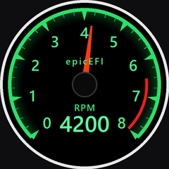

# Round 1.28 Gauge

A **Waveshare ESP32-S3-LCD-1.28** turned into an automotive instrument.

The dial is drawn from scratch into an RGB565 framebuffer — **no graphics
library** — and pushed to the panel as whole frames. It runs at **38.5 fps**
on the 240×240 round display.



---

## Status

| | |
|---|---|
| Panel | GC9A01A 240×240 round IPS, SPI, driving at 80 MHz |
| Firmware | 403 KB, 87 % of the 4 MB app slot free |
| Frame rate | **38.5 fps** delivered (measured on the dial) |
| Tests | 81 host unit tests + 29 contract checks, all passing |
| Graphics | none — a framebuffer and about 600 lines of drawing code |

The gauge currently shows a tachometer with a boot self-test sweep and an
engine simulator. Temperature, boost and battery presets are wired up and
switchable at runtime.

## Why there is no LVGL

The first version of this used LVGL 9.6. It worked, but the panel only ever
painted part of the dial — whole sectors stayed black, or went black a fraction
of a second after being drawn correctly.

A solid white fill drawn straight into a framebuffer fills the panel edge to
edge and rock steady. That was the whole answer: **the fault was LVGL's
partial-flush path**, not the panel, the wiring or the power. Dropping it made
the firmware 61 % smaller (869 KB → 337 KB) and the display perfect.

Everything here is plain C on one framebuffer. The full reasoning, including
what was ruled out along the way, is in
[`docs/hardware.md`](docs/hardware.md).

## Hardware

| | |
|---|---|
| Board | Waveshare ESP32-S3-LCD-1.28 (non-touch) |
| SoC | ESP32-S3R2, dual-core LX7 @ 240 MHz, 2 MB in-package PSRAM |
| Flash | 16 MB Winbond W25Q128JV |
| Display | GC9A01A round IPS, 240×240, 4-wire SPI |
| USB | CH343P → UART0 on GPIO43/44 (COM port, 115200) |
| IMU | QMI8658 on I²C (SDA GPIO6 / SCL GPIO7) |
| Battery | ADC on GPIO1 through a 200K/100K divider |

Display pins: **DC 8, CS 9, CLK 10, MOSI 11, RST 12, backlight 40.**

Full discovery record and pinout: [`docs/hardware.md`](docs/hardware.md).

## Layout

```
firmware/
  components/
    bsp/     SPI, the GC9A01A panel, backlight.  Nothing else.
    gfx/     RGB565 framebuffer, primitives, generated bitmap fonts
    gauge/   gauge_math / theme / presets   pure C, host-tested
             gauge_render.c                 draws into the gfx surface
  main/      application: console, gauge driver, bring-up test screens
tests/
  host/      unit tests, run on the desktop against a stubbed panel
  py/        contract checks on the generated artefacts
tools/
  test.ps1            run every suite
  idf.bat             run idf.py with the toolchain environment loaded
  gen_font.py         rasterise the fonts -> gfx/gfx_font_data.c
  render_preview.py   host-rendered dial mock-ups
  probe.py            identify the board / dump chip info
  flash.ps1           reboot into the ROM bootloader and flash
  flash_chunked.py    flash in 16 KB pieces (workaround, see hardware.md)
docs/
  hardware.md      what the board is, how it was discovered, what was wrong
  development.md   toolchain, build, flash, tests, design notes
```

## Quick start

```powershell
tools\test.ps1                  # host tests + contract checks, ~2 s

tools\idf.bat build

# put the board in the ROM bootloader - from the running app, just type:
#   gauge> bootloader
tools\idf.bat -p COM6 flash monitor
```

`tools\flash.ps1` wraps the reboot-and-flash sequence into one command.

### Getting into the ROM bootloader

The board cannot be reset into download mode over USB: the CH343P's DTR line is
not wired to the boot strap, so esptool's reset sequences cannot pull `GPIO0`
low. Two ways in:

* **From the running app** — type `bootloader` at the `gauge>` console. The app
  sets `RTC_CNTL_FORCE_DOWNLOAD_BOOT` and resets, and the chip sits in the ROM
  bootloader until you flash it. This is the normal path and needs no buttons.
* **From cold** — hold **BOOT**, press and release **RESET**, keep holding BOOT
  for a second, then release it.

`EN` *is* wired to the CH343P's RTS line, so esptool can restart the chip after
flashing on its own.

## Console

The REPL comes up on the USB serial port **before** the display is touched, so a
dead panel can never lock you out.

| Command | What it does |
|---|---|
| `help` | List commands |
| `gauge` | List instruments; `gauge temp` switches |
| `demo on\|off\|sweep` | Engine simulator, or replay the self-test sweep |
| `value 4200` | Drive the needle directly (stops the simulator) |
| `fps` | Delivered frame rate; `fps off` hides the on-dial readout |
| `backlight 0-100` | Backlight duty |
| `test fill\|bars\|grid\|circle\|quad` | Bring-up test screens |
| `next` | Cycle test screens |
| `flush` | Panel transfer statistics |
| `bootloader` | Reboot into ROM download mode, ready for `idf.py flash` |
| `free` / `version` | Heap usage / build info |

`test fill` is the one worth remembering: a solid white screen is the fastest
way to tell a panel problem from a drawing problem.

## Tests

```powershell
tools\test.ps1                  # host + contracts
tools\test.ps1 -Filter render   # one suite
```

`gfx` talks to the panel through exactly one function, so **the framebuffer and
the whole gauge renderer are tested on the desktop** with the SPI stubbed out.
That is where the bugs get caught: the host tests found a real one where every
glyph was drawn one ascent too low, which on the panel showed up as the bottom
of the "6" disappearing into the green band behind it.

See [`tests/README.md`](tests/README.md).

## Adding a gauge

Everything that distinguishes one instrument from another lives in
`gauge_config_t`. Add a preset in
[`gauge_presets.c`](firmware/components/gauge/gauge_presets.c):

```c
static const gauge_config_t s_oil_temp = {
    .caption         = "OIL TEMP",
    .wordmark        = "epicEFI",
    .min             = 40.0f,
    .max             = 160.0f,
    .major_step      = 20.0f,
    .minor_per_major = 4,
    .alarm_from      = 130.0f,     /* warning band start; > max for none  */
    .decimals        = 0,
    .slew_time       = 2.5f,       /* slow, damped movement               */
    .theme           = &gauge_theme_greddy,
};
```

Register it in `s_presets[]` and it appears in the `gauge` console command.
`tools\test.ps1` then picks it up automatically: the preset tests build a dial
for every entry and check the geometry is self-consistent.

To see it before flashing, add the same preset to
`tools/render_preview.py` and run it — a contract check fails if the two lists
drift apart.

## Visual design

The dial is a homage to the classic 1990s Japanese instrument look, with the
details that make it read as one:

| Feature | How it is done |
|---|---|
| Green rail | a continuous arc at the outer edge, never interrupted |
| Warning sector | a **separate arc set inboard of the ticks**, not a recolour of them |
| Major ticks | **wedges pointing at the centre**, flat edge on the rail |
| Minor ticks | thin radial lines |
| Numerals | generated bitmap font, centred on cap height |
| Needle | tapered polygon rotated about the dial centre, with a counterweight tail |
| Branding | `epicEFI` above the hub |

`tools/render_preview.py` renders every preset on the host so the design can be
reviewed without flashing.

## Roadmap

- [x] Board bring-up, toolchain, gauge renderer, RPM demo
- [x] No-graphics-library rewrite, 38.5 fps
- [x] Host tests for the renderer and the drawing primitives
- [ ] Real data: CAN / OBD-II / analogue inputs
- [ ] Persist gauge selection and calibration in NVS
- [ ] QMI8658 IMU: accelerometer peak-hold, orientation sensing
